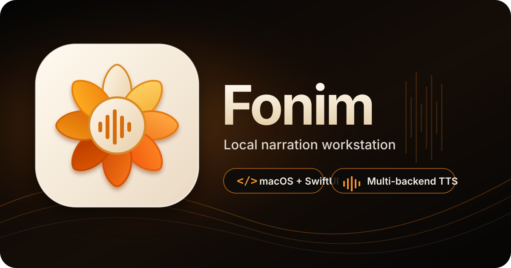
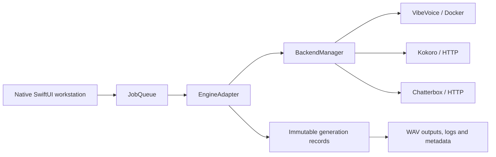

<p align="center">
  
</p>

<h1 align="center">Fonim</h1>

<p align="center">
  A native macOS workstation for local, reproducible text-to-speech production across interchangeable model backends.
</p>

<p align="center">
  
  
  
  
</p>

> **Development status:** Fonim is a working engineering prototype under active development. It can be built and packaged locally, but it is not yet a notarized public release.

## What Fonim is

Fonim turns local text-to-speech engines into a coherent Mac production environment. It organizes scripts, batches, voices, presets, queued jobs, generated audio, logs, and metadata without making model-specific services or Docker commands the primary user experience.

The application is deliberately **not tied to one model**. SwiftUI remains backend-neutral, while generation runs through a queue and adapter boundary:



## Engineering highlights

- **Native macOS application:** SwiftUI scenes, menus, Settings, inspectors, auxiliary windows, playback, Finder reveal, Quick Look, drag-and-drop, and sharing.
- **Interchangeable engines:** model-specific behavior is isolated behind `EngineAdapter` implementations rather than embedded in the interface.
- **Asynchronous job orchestration:** generation enters through `JobQueue`, with cancellation, retry, duplicate, progress, and terminal queue states.
- **Managed backend lifecycle:** installation, preparation, health checks, updates, repair, reset, stop operations, and disk-usage reporting are represented as typed application services.
- **Reproducible output history:** every completed generation retains its source text, audio, logs, settings, and metadata as an immutable session record.
- **Durable workstation records:** projects, scripts, batches, voice presets, and generation presets are stored separately from immutable history.
- **Defensive file handling:** generated sessions are archived instead of overwritten or destructively deleted.
- **Release tooling:** SwiftPM builds, automated core checks, local app-bundle assembly, signing verification, and release-candidate smoke testing.

## Backend support

| Backend | Integration | Intended role |
| --- | --- | --- |
| **VibeVoiceTTS** | `VibeVoiceDockerAdapter` | Long-form, expressive local narration through managed Docker infrastructure |
| **Kokoro** | `KokoroHTTPAdapter` | Fast previews and lightweight narration through a local HTTP service |
| **Chatterbox TTS** | `ChatterboxHTTPAdapter` | Expressive narration with predefined or reference voices through a local HTTP service |
| **Future engines** | Adapter extension point | ComfyUI workflows, F5-TTS, CosyVoice, and other local engines without redesigning the UI |

Backend runtimes and model files remain external infrastructure. Fonim does not silently install privileged helpers or conceal backend-specific security and compatibility constraints. See [BACKENDS.md](BACKENDS.md) for the current contracts and limitations.

## Product model

Fonim separates editable work from generated evidence:

- **Workspace:** projects, scripts, batches, voices, and presets that can evolve over time.
- **Queue:** pending and completed generation requests, including retry and duplicate actions.
- **History:** immutable generation sessions containing `input.txt`, `output.wav`, `log.txt`, and `metadata.json`.
- **Outputs:** a native browser over generated WAV sessions for previewing, filing, sharing, revealing, and archiving.
- **Backends:** profiles, readiness snapshots, setup checks, operations, and engine adapters.

This separation allows one script to produce many traceable generations without overwriting prior inputs or audio.

## Build and verify

### Requirements

- macOS 13 or later
- Swift 5.9 toolchain / Xcode command-line tools
- Backend-specific local services as needed
- Docker only when using the managed VibeVoice backend

### Core validation

```sh
swift build
swift run VibeVoiceBatchCoreChecks
./script/build_and_run.sh --verify
```

### Build and launch the app bundle

```sh
./script/build_and_run.sh
```

### Create a local package

```sh
./script/package_app.sh
```

The packaging script produces `dist/Fonim.app` and a ZIP archive. The default build is ad-hoc signed for local testing and trusted direct transfer; public distribution still requires Developer ID signing and notarization.

## Repository structure

```text
Sources/
  VibeVoiceBatch/           SwiftUI application and presentation layer
  VibeVoiceBatchCore/       Models, adapters, stores and backend services
  VibeVoiceBatchCoreChecks/ Lightweight acceptance checks
Resources/                  App icon and bundled reference data
script/                     Build, launch, package and smoke-test automation
docker_overrides/           Reviewed container-specific compatibility files
```

## Architecture and operating documentation

- [Architecture](ARCHITECTURE.md) — ownership boundaries and current vertical slice
- [Model adapter specification](MODEL_ADAPTER_SPEC.md) — backend-neutral generation contract
- [Backends](BACKENDS.md) — profiles, runtime operations, compatibility notes, and risks
- [Error handling](ERROR_HANDLING.md) — recoverable failures and user-facing error policy
- [Human Interface Guidelines checklist](HIG_CHECKLIST.md) — native macOS interaction requirements
- [Acceptance](ACCEPTANCE.md) — automated and product-level validation
- [Packaging](PACKAGING.md) — local distribution, signing, and notarization path

## Naming

**Fonim** is the product name, Swift package name, executable name, and app-bundle name. The repository name and several internal Swift targets still use `VibeVoiceBatch` temporarily to preserve existing bundle identifiers, settings keys, history paths, and source continuity during the product migration.

A future repository rename to `Fonim` is presentation-only; internal target renaming should remain a separate, explicit migration.

## Related model projects

Fonim is an independent workstation and is not affiliated with the model authors.

- [Microsoft VibeVoice](https://github.com/microsoft/VibeVoice) and its [TTS overview](https://github.com/microsoft/VibeVoice/blob/main/docs/vibevoice-tts.md)
- [Kokoro](https://github.com/hexgrad/kokoro)
- [Chatterbox TTS](https://github.com/resemble-ai/chatterbox)

Use generated speech and reference voices only where you have the necessary rights and consent. Model licenses, runtime requirements, and output policies remain the responsibility of each backend integration.
